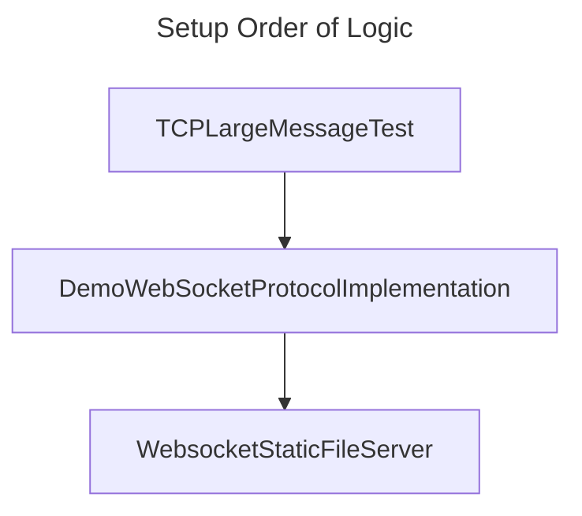

# TCP Large Message Test

Status: In-progress
Estimated effort: 20 hours

This setup tests what happens to TCP when VERY large packages are sent - because I remember from Unreal times there are talks on network limit on 512 bytes of data size, and based on my practical experience with Godot, it cannot receive large WebSocket messages reliable - is this fundamentally because of how TCP works? That's what this setup is inteded to test out.

Specifically, we test:
1. Whether it's possible to send very large packages in TCP at all and how complicated is the API/protocol. A: Yes it is and it's only limited by system memory and maybe bandwidth. Using Socket is slightly lower level but using TcpClient/TcpListener's in C# is straightforward and it handles everything for you and exposes the underlying as stream which allows convinient stream manipulations (e.g. BinaryWriter).
2. Any difference in behavior between text-based message and binary data. A: All data are ultimately sent as bytes.
3. What exactly is this "data order" protection mechanism? A: Either bytes within a single packet/frame/`Send()` or sequential messages after each `Send()` - TCP ensures all of them are in order.
4. How fast/efficient is sending data this way, especially when compared to UDP. The overhead is likely from network and from waiting and ensuring right order through handskaing. PENDING READING ON RFC PROTOCOL to really understand how error-protection is handled and how many network overhead really there is.
5. Any other related concerns. A: None so far; Ideally we test real performance across real network.
6. What's the relation between TCP packet size, Maximum Transmission Unit size, Ethernet MTU 1500, Microsoft Winsock Tcp window size, and TCP Maximum Segment Size? A: PENDING.
7. Besides system/process memory, how is hardware (Ethernet card) buffer size come into play - do we need to consider that? How large is that buffer? A: Looks like hardware/system "buffer" is just a concept - specific programming languages don't need to worry about that. On the other hand, it's very likely if CPU/system is not able to digest such packets in time, data will drop. That will be significant for UDP but for TCP it doesn't matter - likely from API/application's standpoint the system will always ensures right amount of data are arrived in order, though we must be aware that `Receive()` is most likely fragmented (that's why TcpListener/TcpClient's `NetworkStream` abstraction is handy - otherwise we would need to handle it (byte monitoring and continous reading/writing and boundary detection) ourselves.
8. How is C# TcpClient/TcpServer different from System.Net.Sockets? A: See notes from [MSDN](https://learn.microsoft.com/en-ca/dotnet/fundamentals/networking/sockets/tcp-classes).

## Observations

* On local machine inside a single process, it seems there is no practical size limit as long as system memory can handle it.
* Because during communication there is no way for the receiving side to know whether data is complete, it looks like it requires the receiving side to continuously examine all received bytes to know it's receiving a complete message - not a fragment, and not a multiple. (Pending some reference on how to best handle this)

Google AI gives following advices for receiving complete TCP messages:

* Create a protocol that transmits fixed-size messages: The receiving TCP program can know when the entire message has been received.
* Use a message marker system: Separate each message with a terminating character to indicate the end of the message.
* Send a fixed-length record at the beginning of each message: This record encodes the length of the remaining bytes in the message.
* Transmit a small header that includes the message length: Since TCP is a reliable protocol, you can read that many bytes.
* Read in a loop until the whole message has been read: Receiving the size of the message at the beginning helps you to read the entire message from the server.
* ReadAll and append to a buffer until you've got it all, then process the buffer: Or you can use LookAhead to see if you've got it all and if not, just leave it in the socket until the next DataAvailable. 

## References

* https://stackoverflow.com/questions/2562343/tcp-socket-communication-limit
* https://superuser.com/questions/1341012/practical-vs-theoretical-max-limit-of-tcp-packet-size "make your writes no larger than 1448 bytes, and perhaps no larger than 1380 bytes." "Your theoretical messaging-protocol server is probably connected to an Ethernet-like network, which probably uses standard 1500 byte frames, so your own server's IP stack would have to fragment that 64KiB write into 46 or so separate packets before it could even begin transmitting them on the first hop" ~~It also sounds some kind of re-ordering at the receiving end is neccessary since TCP only guarantees arriving order of bytes within the packet, not between packets.~~ Actually TCP ensures Sends arrive in order irrelevant of packet size - this is because packets have a unique order index. See https://stackoverflow.com/questions/1691179/is-tcp-guaranteed-to-arrive-in-order
* https://www.reddit.com/r/csharp/comments/kpqs53/sending_multiple_messages_over_tcp_socket_over/ Notice that one uses Socket.Receive, which returns bytes available in buffer but not necessarily everything.
* https://stackoverflow.com/questions/66857509/how-does-tcp-handle-a-file-with-large-size
* https://learn.microsoft.com/en-ca/dotnet/fundamentals/networking/sockets/tcp-classes
* https://stackoverflow.com/questions/66857509/how-does-tcp-handle-a-file-with-large-size "On the receiving side of the TCP, there is no relation to the number of send operations and the number of receive operations. If the sender send 5 times 10 bytes consecutively and fast, very likely they will be received as 50 bytes in one receive operation."

## Related Setups

* https://github.com/Charles-Zhang-CSharp/DemoWebSocketProtocolImplementation
* https://github.com/Charles-Zhang-CSharp/WebsocketStaticFileServer

